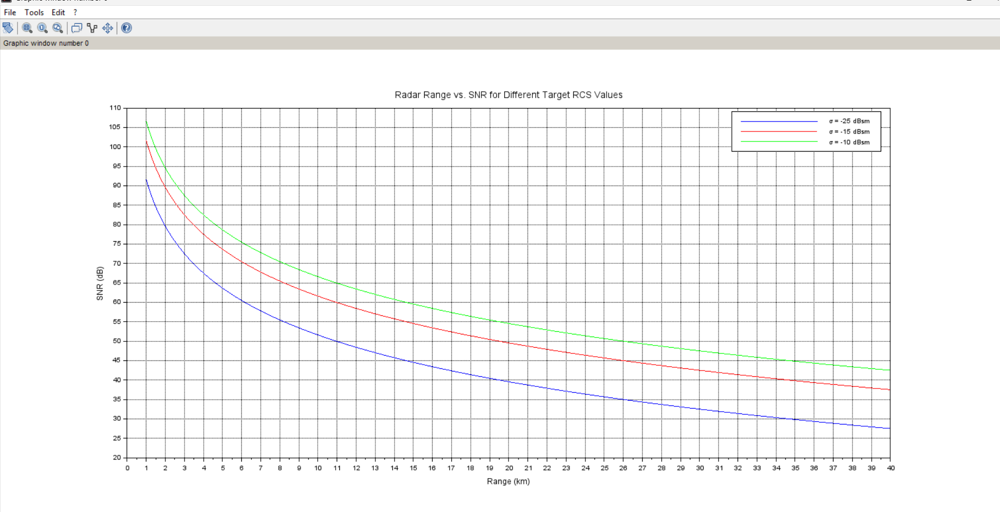

# Radar SNR vs. Range for Different Target RCS Values

## 📝 Description

This script calculates and plots the **Signal-to-Noise Ratio (SNR)** of a radar return as a function of range for **different target Radar Cross Section (RCS)** values.  
The main components taken into account in this simulation include:

- Transmitter power
- Antenna gains
- Wavelength of the radar signals
- Duration of pulse (`to`)
- System losses and noise
- Distance (Range) to the target
- Target's radar cross-section (σ)

---

## 🔹 File

- **File:** `radar_snr_vs_range.sce`
- **Language:** Scilab
- **Environment:** SciLab 6.x

---

## 🟣 Main Calculations

The radar SNR as a function of range \( r \) is defined by:

$$
SNR(r) = \frac{ P_t \cdot G_t \cdot G_r \cdot \lambda^2 \cdot \sigma \cdot \ tau }{ (4\pi)^3 \cdot k \cdot T_s \cdot F \cdot L \cdot r^4 }
$$

Where:

|          | Meaning |
|---------|---------|
| \( P_t \) | Transmitter power |
| \( G_t \), \( G_r \) | Transmitter and receiver antenna gains |
| \( \lambda \) | Wavelength |
| \( \sigma \) | Target radar cross-section |
| \( T \) | Integrator or pulse duration |
| \( k \) | Boltzmann's constant |
| \( T_s \) | System temperature |
| \( F \) | Noise figure |
| \( L \) | Loss |
| \( R \) | Distance to target |
  
---
--

## 🟣 Values Used in this Script:

|          | Values |
|---------|---------|
| Transmitter Power \( P_t \) | 20 kW |
| Antenna Gain \( G_t \), \( G_r \) | 39 dB |
| Operations Freq \( f \) | 3.2GHz |
| Wavelength \( \lambda \) | \( c / f \) |
| Pulse Duration \( \ tau \) | 3ms |
| System Loss \( L \) | 6.5 dB |
| Noise Figure \( F \) | 3 dB |
| RCS Values \( \sigma \) | -25, -15, -10 dBsm |
| Distance \( r \) | 1km to 40km |
| Number of points | 500 |
  
---

## 🟣 Plot:

Running this script produces a plot of **SNR (in dB) vs. Distance (in km)** for the 3 different RCS values.  
Different colors (blue, red, green) represent different RCS.

---

## 📊Graph
Here's the Graph for this project:



## 🟣 How to Run:

1. Open **Scilab 6.x**.
2. Open this script (`radar_snr_vs_range.sce`) in Scilab.
3. Run the script by clicking **Execute File** or simply typing:

```scilab
exec('radar_snr_vs_range.sce');
